# Ansible Configuration Management Automation

*Demonstration of how to automate routine tasks by integrating Ansible Configuration Management with Jenkins at the same time we write code using a data serialization language called YAML. The source code used on this project was retrieved from darey.io.*

*We will use Ansible Configuration Management to automate routine tasks of the 4 projects we have been working on so far:*

Project 1: https://github.com/Antonio447-cloud/devops-website-solution-using-nfs-and-lvm-project1

Project 2: https://github.com/Antonio447-cloud/load-balancer-solution-using-apache-project2

Project 3: https://github.com/Antonio447-cloud/jenkins-continuous-integration-project3

Project 4: https://github.com/Antonio447-cloud/SSL-TLS-cryptographic-protocol-new-dns-name-and-lb-project4

-------------------

    Happy learning!

## Outline

- Automate routine tasks by integrating Ansible Configuration Management with Jenkins.

- Use YAML syntax to express Ansible playbooks.

- Create an Ansible playbook to automate the servers configuration.

**NOTE**: *Playbooks tell Ansible what to execute.*

## Install and Configure Ansible on EC2 Instance

First, we need to update the name tag on our Jenkins Instance to "Jenkins-Ansible". We will use this instance to run playbooks. Then on our GitHub account, we create a new repository and name it "automation-using-ansible-config-mgt-and-jenkins".

We SSH into our Jenkins-Ansible instance and install Ansible:

`sudo apt update`

`sudo apt install ansible -y`

We check our Ansible version by running:

`ansible --version`

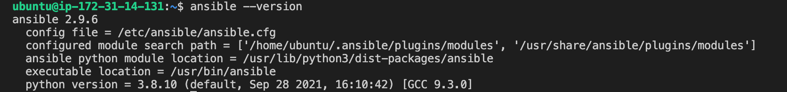

## Installing and Configuring the Jenkins Server

We need to configure an Ansible freestyle project using a Jenkins server. Instructions on how to install and configure your Jenkins server from scratch: 

https://github.com/Antonio447-cloud/jenkins-continuous-integration-project3

- On our Jenkins web console we click "New Item". Then create a new Freestyle project, we can name it "Ansible":

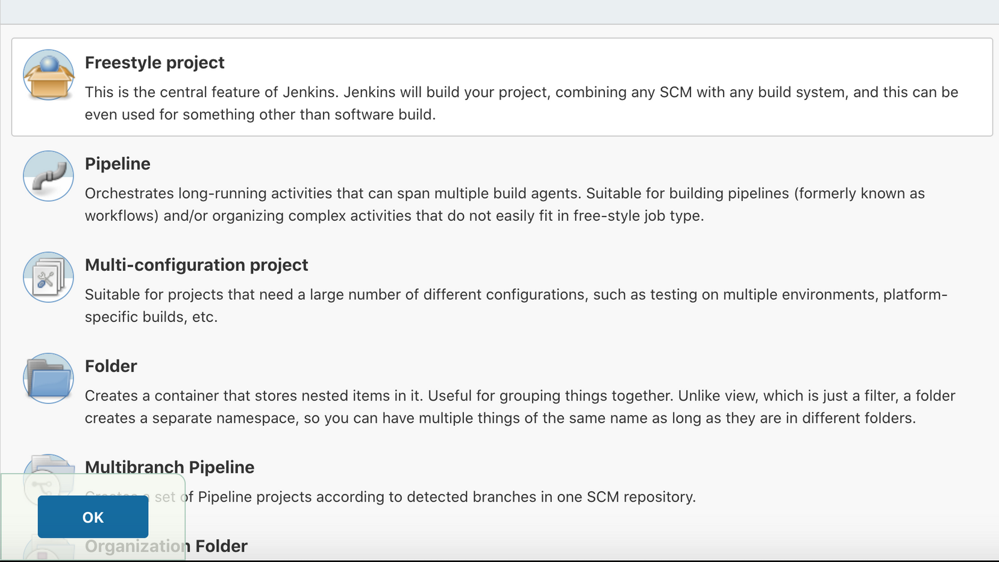

- We configure our Jenkins Freestyle project to point our "automation-using-ansible-config-mgt-and-jenkins" repository:

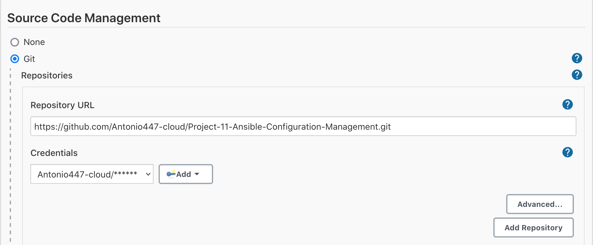

- We enable GitHub hook trigger for GITScm polling:

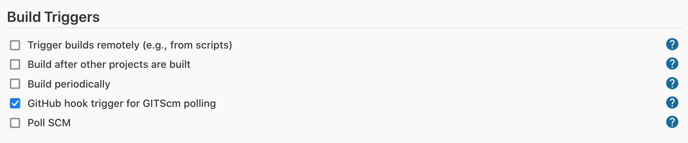

- We configure a webhook in GitHub and set the webhook to trigger the Ansible build by using the "Ansible-Jenkins" instance public IP address:

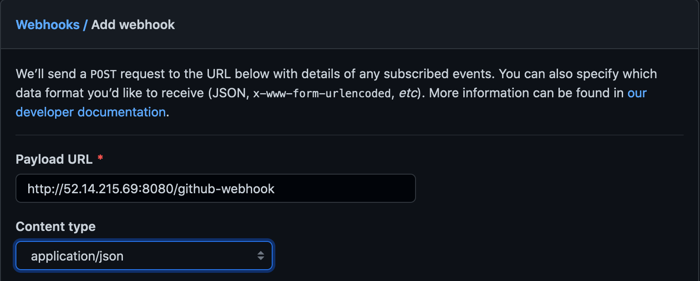

- We change Branch Specifier from */master to */main

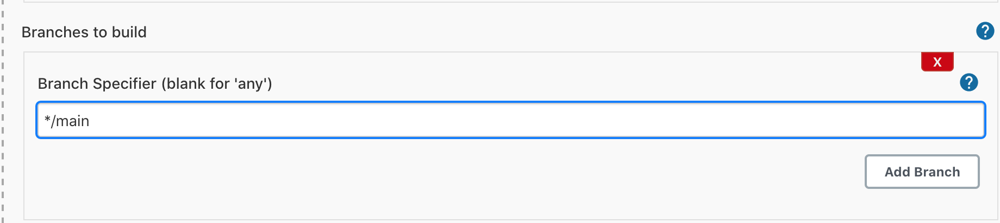

- We configure a Post-build job to save all (**) files:

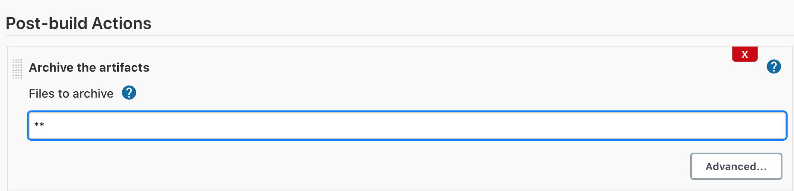
    
*Then we test our setup by making some change on the readme.md file in the main branch. We make sure that the build starts automatically (build history) and that Jenkins shows the files that were changed (last succesful artifacts):*

**We see that our builds were succesful**:

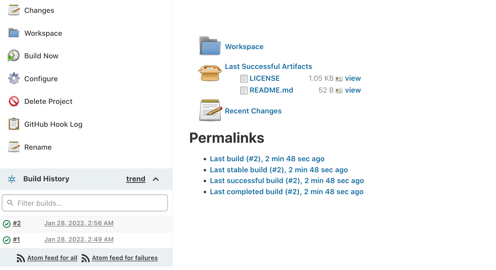

Now we run:

`sudo ls /var/lib/jenkins/jobs/Ansible/builds/`

- **NOTE**: *Remember that Linux file system is case sensitive.*

Then:

`sudo ls /var/lib/jenkins/jobs/Ansible/builds/<build_number>/archive/`

So:

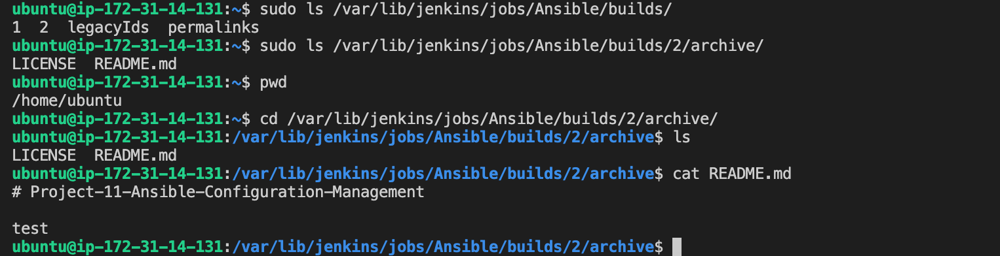

Now our setup looks like this:

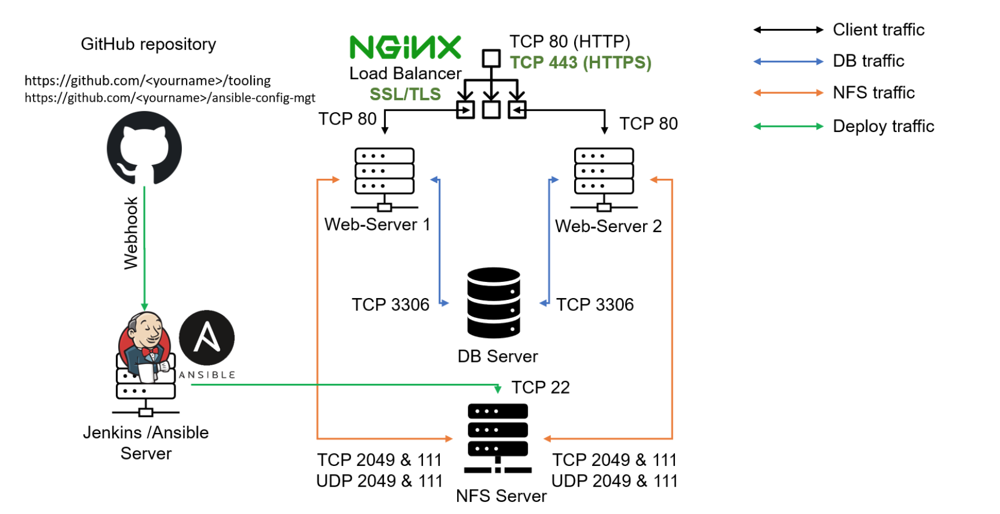

## Prepare Our Development Environment Using Visual Studio Code

The first part of 'DevOps' is 'Dev', which means we will require to write some code and we shall have proper tools that will make our coding and debugging comfortable. We will need an Integrated Development Environment (IDE) or source-code editor to do this.

After we have successfully installed VS Code, we need to configure it, to connect it to our newly created GitHub repository.

- **NOTE**: *Make sure we have the extension 'Remote Development' installed and enabled.*

## Begin Ansible Development

In our "automation-using-ansible-config-mgt-and-jenkins" GitHub repository, we need to create a new branch that will be used for development of a new feature. We can name it "prj-11-ansible":

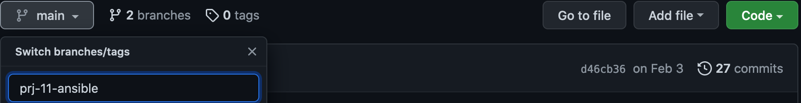

**NOTE**: *We should give our branches descriptive and comprehensive names, as well as adding a topic and a brief description of what the branch is about, for example a bugfix, hotfix, feature, release, etc.*:

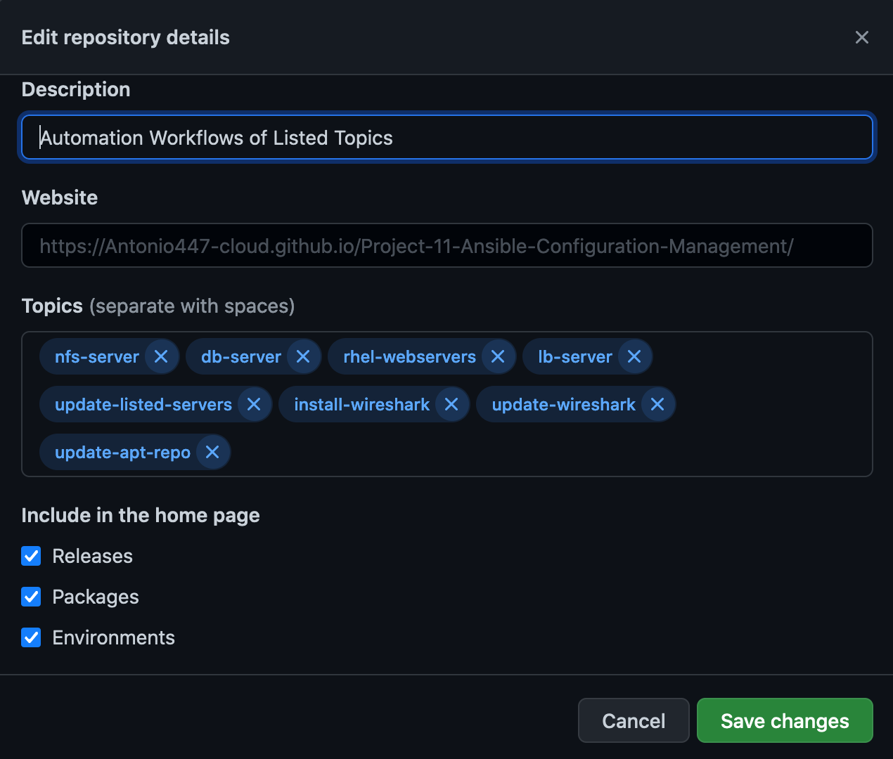

Now, we need to checkout the newly created feature branch to our local machine and start building our code and directory structure:

`git branch`

`git status`

`git checkout -b prj-11-ansible`

We create a new directory and name it "playbooks". This directory will be used to store all of our playbook files:

`mkdir playbooks`

We create a new directory and name it inventory. This directory will be used to keep our hosts organized:

`mkdir inventory`

Within the playbooks folder, we create our first playbook, and name it "common.yml":

`cd playbooks`

`touch common.yml`

Within the inventory folder, we create an inventory file for each environment (Development, Staging, Testing and Production) dev, staging, uat, and prod respectively:

`cd ..`

`cd inventory`

`touch dev.yml staging.yml uat.yml prod.yml`

## Setting up an Ansible Inventory

An Ansible inventory file defines the hosts and groups of hosts upon which commands, modules, and tasks in a playbook operate. Our intention is to execute Linux commands on remote hosts and ensure that the intended configuration on a particular server where run such commands occur. Therefore, it is important to have a way to organize our hosts on the inventory file.

- **IMPORTANT NOTE:** *Ansible uses TCP port 22 by default, which means it needs to SSH into target servers from our Jenkins-Ansible host. To do this we need to copy the private (.pem) key to our server. Do not forget to change permissions to your private key with the chmod 400 private-key.pem command, otherwise the instance will not accept the key.*

So, we run the following code on the same directory where we have the private key that we use to SSH into our Ansible-Jenkins instance:

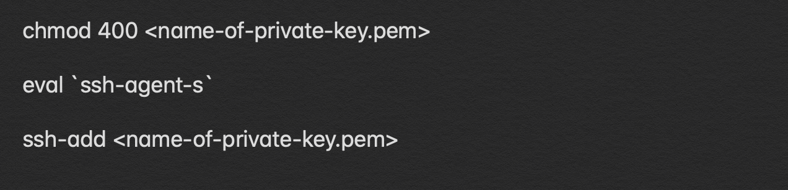

In the same directory where we have the private key, we ssh into the Jenkins-Ansible instance:

`ssh -A ubuntu@<public-ip>`

We confirm that the key has been added:

`ssh-add -l`

Now, we start the 4 RHEL based servers that we have been using. The 4 RHEL servers include: 1 NFS server, 2 web servers and the database server. Then we start our Ubuntu Load Balancer server.

We update our inventory/dev.yml file with this snippet of code:

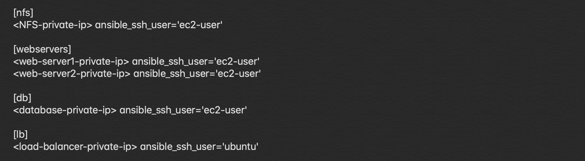

## Creating a Common Playbook

In our common.yml playbook we will write configuration for repeatable, re-usable, and multi-machine tasks that is common to systems within the infrastructure.

To do so we update our playbooks/common.yml file with the following code:

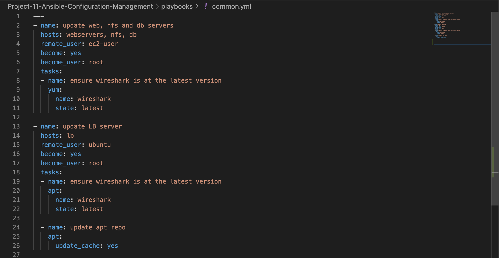

We need to examine the code above and try to make sense out of it. This playbook is divided into two parts, each of them is intended to perform the same task: install wireshark utility (or make sure it is updated to the latest version) on our RHEL 8 and Ubuntu servers. It uses root user to perform this task and the respective package manager: yum for RHEL 8 and apt for Ubuntu.

## Updating GitHub with the latest code

In the real world, we will be working within a team of other DevOps engineers and developers. So, it is important to learn how to collaborate with the help of GitHub. In many organizations there is a development rule that does not allow to deploy any code before it has been reviewed by an extra pair of eyes. This is also called the "Four eyes principle".

Now we that we have a separate branch, we need to know how to raise a Pull Request (PR), to get our branch peer reviewed and merged into the master branch.

Commit the code into GitHub:

`git status`

`git add <selected files>` 

`git commit -m "commit message"`

`git push`

- We create a pull request and merge it.

- Wear a hat of another developer for a second, and act as a reviewer.

- If the reviewer is happy with our new feature development, we merge the code to the master branch.

Then we head back to our terminal, checkout from the feature branch into the main, and pull down the latest changes:

`git checkout main`

`git add .`

`git commit -m "commit message"`

`git push`

Once our code changes appear in our main branch, Jenkins will do its job and save all the files to:

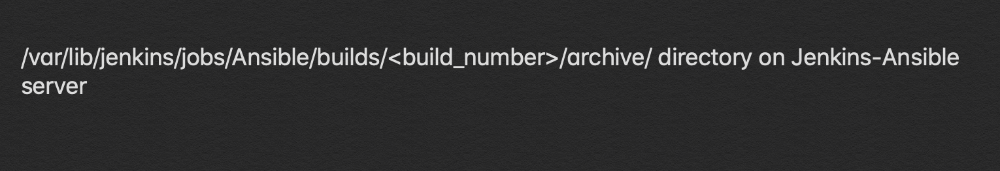

## Running First Ansible Test

Now, it is time to execute the ansible-playbook command and verify that our playbook works:

`ansible-playbook -i /var/lib/jenkins/jobs/ansible/builds/<build-number>/archive/inventory/dev.yml /var/lib/jenkins/jobs/ansible/builds/<build-number>/archive/playbooks/common.yml`

**NOTE:** We ran the previous command without sudo, this is because we had added an ssh key to ssh-agent for our regular user. If we try to run this command with sudo we will have to explicitly pass the ssh key with the private-key `<path-to-private-key>` parameter.

We can see that our playbook works:

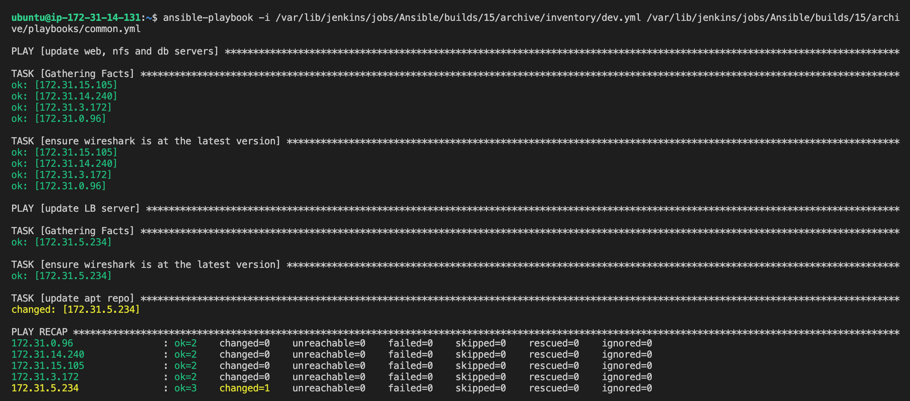

Now, we can go to each of the servers and check if wireshark has been installed by running:

 `wireshark`
 
Or:
  
`wireshark --version`

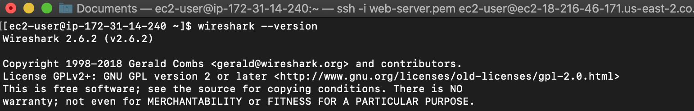

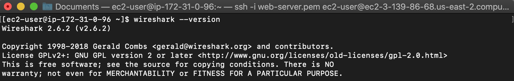

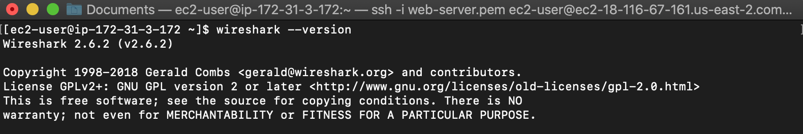

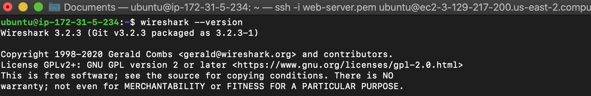

Our updated setup with the Ansible architecture looks like this:

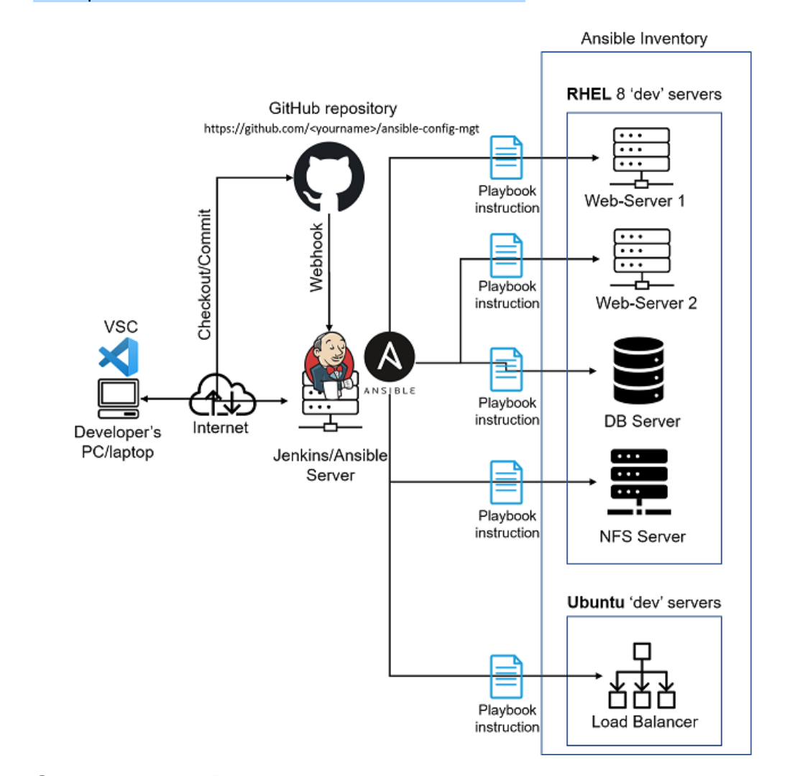

Congrats!! You have just automated automate routine tasks  by integrating Ansible Configuration Management with Jenkins!

----------------

## Optional Step

Update the Ansible playbook with some new Ansible tasks and go through the full checkout `-> change codes -> commit -> PR -> merge -> build ->` cycle to see how easily you can manage servers fleet of any size with just one command!
